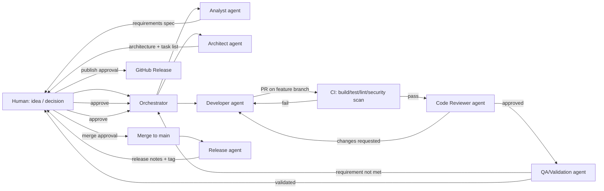

# AI-Powered Software Development Pipeline
## Requirements & Environment Assessment for a Hobby Developer (2026)

*Prepared for: Philipp — IT Systems Engineer, hobby programmer*
*Scope: research and architecture assessment only — no implementation*
*Date: September 2026*

Throughout this document, claims are tagged so you can tell what's solid ground and what's judgment:
**[Established]** — shipping, documented, in production use today.
**[Experimental]** — real but early, evolving fast, or thin on track record.
**[Recommendation]** — my judgment call for your situation, not a fact.
**[Assumption]** — something I'm assuming about your goals/constraints that you should confirm.

---

## 1. Executive Summary

The good news: almost everything you need to build this already exists, and none of it requires an enterprise platform. The bad news: the ecosystem is genuinely chaotic right now — dozens of "agent frameworks," several competing standards, and a lot of blog-driven hype. The job here is less "find the missing piece" and more "resist the temptation to assemble ten tools when three will do."

**[Recommendation]** For a solo hobby developer in 2026, the right foundation is **GitHub as the system of record** (issues, PRs, Actions, branch protection) plus **Claude Code / the Claude Agent SDK as the agent runtime**, using **subagents** for role separation rather than a separate multi-agent orchestration framework. Layer in **GitHub Spec Kit** (or an equivalent spec-driven workflow) for the idea→requirements→plan→tasks stages, and use **GitHub Actions** as the place where verification (tests, linting, security scans) happens outside the agent's own say-so. This gets you almost everything on your requirements list — defined roles, explicit artifacts, review separation, quality gates, human approval, traceability — without adopting LangGraph, CrewAI, AutoGen, or a dedicated orchestration platform.

The reason to avoid a heavyweight framework isn't that they're bad — LangGraph and CrewAI are mature and widely used **[Established]** — it's that they solve a problem you don't have yet: coordinating many long-running, loosely-coupled agents across a large team. You have one developer (you), one repo at a time, and a strong preference for low complexity. A framework adds a second thing to learn, version, and debug, on top of the AI behavior itself. Every extra moving part is a thing that breaks at 11pm when you just wanted to ship a small feature.

The most important design principle in your list — *"an agent should not simply declare its work complete"* — is also the one most tooling gets wrong by default. The fix isn't a smarter agent, it's structural: route every claim of "done" through something that isn't the agent itself — a test suite, a linter, a second agent with only read access, or you. This document is built around that idea throughout.

---

## 2. Proposed Lifecycle

The lifecycle you proposed is sound. Below is each stage with its purpose, its primary artifact, and who (human/agent) drives it.

| Stage | Purpose | Primary output | Primary driver |
|---|---|---|---|
| **Idea** | Capture an unstructured intent before it's lost or over-specified too early | Idea note (a few sentences, freeform) | Human |
| **Concept** | Turn the idea into a testable proposition: who is this for, what problem does it solve, what does success look like | Concept brief (problem, users, success criteria, non-goals) | Human + Analyst agent |
| **Requirements** | Turn the concept into specific, verifiable functional and non-functional requirements | Requirements spec | Analyst agent, human-approved |
| **Architecture / Design** | Decide the technical approach: components, data flow, tech stack, key trade-offs | Architecture doc + ADRs (Architecture Decision Records) | Architect agent, human-approved |
| **Task decomposition** | Break the design into independently implementable, testable units of work | Task list (linked to requirements) | Architect/Planner agent |
| **Implementation** | Write or modify code for one task at a time, in an isolated branch | Code diff / PR | Developer agent |
| **Testing** | Prove the implementation behaves as specified | Test code + test results | Developer agent + Test Engineer agent |
| **Review** | Independently check code quality, correctness, and adherence to the design | Code review report | Reviewer agent (separate from implementer) |
| **Validation** | Confirm the delivered feature actually satisfies the original requirement, not just "tests pass" | Validation report (requirement → evidence mapping) | QA/Validation agent + human spot-check |
| **Release** | Package, tag, and publish a version with a clear record of what changed | Release notes + tagged release | Release agent, human-approved |
| **Maintenance** | Monitor, triage issues, handle dependency/security updates, regression-test changes | Issue triage, patch PRs, dependency reports | Maintenance agent, human-approved for merges |

This is essentially a **stage-gate pipeline with feedback loops**, not a strict waterfall — a failed test gate should be able to kick a task back to "Implementation," and a failed validation gate should be able to kick something back to "Requirements" if the requirement itself was wrong. Section 6 covers this in more depth.

**[Recommendation]** For a hobby project, collapse "Concept" and "Requirements" into a single lightweight document for anything smaller than a multi-week feature. Reserve the full separation for genuinely new projects or major features. Process overhead that doesn't pay for itself is the single biggest risk to this whole effort surviving past month two.

---

## 3. Proposed Agent Roles

Rather than assuming all eleven roles you listed are warranted, here's an assessment of which earn their keep for a solo hobby pipeline, sized to actual value delivered per unit of complexity added.

| Agent | Responsibilities | Inputs | Outputs | Reviews / is reviewed by |
|---|---|---|---|---|
| **Analyst** (essential) | Turns ideas into concept briefs and requirements; flags ambiguity instead of guessing | Idea note, human answers to clarifying questions | Concept brief, requirements spec | Human approves before Architecture stage |
| **Architect** (essential) | Produces architecture doc, ADRs, and a task breakdown; makes explicit trade-off calls | Requirements spec | Architecture doc, task list | Human approves before Implementation stage |
| **Developer** (essential) | Implements one task at a time in an isolated branch; writes accompanying tests | Task spec, architecture doc, existing codebase | Code diff, unit tests, PR description | Reviewed by Code Reviewer agent; never self-merges |
| **Code Reviewer** (essential) | Independently reviews the diff for correctness, security, style, and requirement adherence — never the same agent/context that wrote the code | PR diff, task spec, coding standards | Review report (approve / request changes, with specifics) | Human is the final approver on merge |
| **Test Engineer** (essential) | Writes/expands test plans and automated tests, especially edge cases the Developer agent didn't think of | Requirements, code diff | Test plan, test code, test results | Cross-checked by CI results (objective, not self-reported) |
| **QA / Validation** (essential) | Confirms the *requirement* is satisfied, not just that tests are green — maps requirement → evidence | Requirements spec, test results, running app | Validation report | Human spot-checks before Release |
| **Security Reviewer** (recommended, can start automated-only) | Reviews dependency changes, flags obvious insecure patterns, checks secrets handling | Code diff, dependency manifest | Security findings report | Human decides on any finding |
| **Documentation Engineer** (recommended, can start as a Developer sub-task) | Keeps README, API docs, and changelogs in sync with what actually shipped | Merged PRs, code | Updated docs | Spot-checked by human, not gated |
| **Release Engineer** (useful once you have multiple releases) | Drafts release notes from merged PRs, tags versions, runs release checklist | Merged PRs since last tag, changelog | Release notes, git tag, GitHub Release | Human approves publish |
| **Maintenance / Monitoring** (useful once something is actually deployed) | Triages incoming issues, proposes dependency bumps, flags regressions | GitHub issues, Dependabot alerts, CI failures | Triage labels, patch PRs | Human approves merges as with Developer |
| **Orchestrator** (structural, not a "role" with domain expertise) | Sequences the above, tracks pipeline state, invokes the right agent at the right time, stops on failure | Pipeline state, gate results | Status, next-step invocation | You, ultimately — it should never silently override a gate |

**[Recommendation]** Start with **Analyst, Architect, Developer, Code Reviewer, Test Engineer** as the five that matter from day one — the roles where "someone independent checks the work" (Reviewer checking Developer, tests checking claims) is the actual value driver. Security Reviewer and Documentation Engineer can begin as **checklists an agent runs through**, not separate personas, until you feel the pain of skipping them. Release Engineer and Maintenance agents earn their keep once you have a project mature enough to have a release cadence and an issue backlog — building them for a project's first month is solving a problem you don't have yet.

The single most load-bearing separation in this whole list is **Developer vs. Code Reviewer**. If one agent (or one context) both writes and reviews its own code, the review is close to worthless — the same blind spots that produced the bug produce the "looks good to me." This is why Claude Code's subagent model, which starts a reviewer subagent with a **fresh, isolated context** (see Section 4), is structurally well-suited here: it's not just a role-play prompt, the reviewer genuinely hasn't seen the implementer's reasoning, only the diff and the spec.

---

## 4. Agent Interaction Model

**[Recommendation]** Use an **orchestrator + specialized subagents** model, not peer-to-peer and not a fully event-driven system. Concretely, this maps directly onto Claude Code's subagent architecture **[Established]**: a main session (you, working interactively, or a top-level agent) delegates well-scoped tasks to subagents defined as markdown files with YAML frontmatter (`.claude/agents/*.md`), each with its own restricted toolset, its own model choice, and — critically — its own isolated context window that does not inherit the parent conversation. Subagents can message each other and the orchestrator via a `SendMessage`-style mechanism, and results flow back up rather than being decided autonomously mid-chain.

Why not the alternatives:

- **Single agent with tools** — simplest, and fine for small tasks, but collapses the separation-of-concerns principle you specifically asked for (nothing reviews the work independently, because it's the same context that did the work).
- **Peer-to-peer agents** — no established framework for a solo/hobby scale actually needs this, and it multiplies failure modes (two agents can talk past each other, loop, or both assume the other is handling something).
- **Fully event-driven workflow** (e.g., agents watching a message bus, triggering off arbitrary GitHub webhooks) — powerful at team scale, but for one person it mostly adds infrastructure (a bus, event schemas, retry logic) without a corresponding benefit; your GitHub Actions triggers (PR opened, check run needed, issue assigned) already provide "eventing" for the parts that benefit from it.
- **Fully hierarchical multi-level agent trees** — Claude Code supports this (subagents can spawn subagents, up to a configurable depth) **[Established]**, but for your use case one level of delegation (orchestrator → specialist) is enough; going deeper adds debugging difficulty disproportionate to the benefit.

### Conceptual flow

Key mechanics that make this hold together:

- **Artifact-first handover.** Every arrow above is a file (spec, PR, report), not a remembered conversation. This is your explicit requirement and it's the right call: it's also what makes the pipeline auditable and resumable across sessions, since none of these agents have persistent memory of each other's reasoning by default.
- **Shared project context, not shared conversation.** The repo itself — a `CLAUDE.md` (or equivalent) at the root, plus the artifacts in a `docs/` or `.pipeline/` folder — is the shared context every agent reads fresh. This avoids the classic multi-agent failure mode of context drift, where two agents develop subtly different understandings of the same requirement because one is working from a stale conversation history.
- **Isolated implementation branches.** The Developer agent works in a feature branch (ideally an isolated git worktree, which Claude Code supports natively), never on `main`. This is both a safety boundary and what makes parallel work (multiple tasks in flight) possible without agents stepping on each other.
- **No agent merges its own work.** Merge to `main` is a human action, gated on CI passing and review approval (Section 6–7).

---

## 5. Artifact & Contract Model

Your instinct to make agents communicate through explicit deliverables rather than conversational context is exactly right, and it's the difference between "an AI helped me code" and "a pipeline I can audit." Below is the artifact set, sized down from your longer list to what's actually load-bearing.

| Artifact | Format | Lives in | Produced by | Consumed by |
|---|---|---|---|---|
| Idea note | Markdown, freeform | `docs/ideas/*.md` or a GitHub Discussion | Human | Analyst |
| Concept brief | Markdown, light structure (problem/users/success criteria/non-goals) | `docs/concept.md` per feature, or issue body | Analyst | Human, Architect |
| Requirements spec | Markdown with a numbered, testable requirement list (YAML frontmatter for IDs/status is a nice-to-have, not essential) | `docs/requirements/<feature>.md` | Analyst | Architect, Test Engineer, QA |
| Architecture doc + ADRs | Markdown; ADRs as short, numbered, immutable records of one decision each | `docs/architecture.md`, `docs/adr/NNNN-title.md` | Architect | Developer, Reviewer |
| Task list | Markdown checklist or GitHub Issues (one issue per task), each linked to a requirement ID | GitHub Issues (recommended) or `docs/tasks.md` | Architect | Developer, Orchestrator |
| Code diff + PR description | Git diff, PR body explaining *why*, linking task/requirement IDs | GitHub PR | Developer | Reviewer, CI, QA, human |
| Test plan & test code | Test code in-repo; a short test plan note for anything not obvious from the tests themselves | `tests/`, PR description | Developer / Test Engineer | CI, QA |
| CI results | Structured pass/fail + logs (JUnit XML, coverage reports) | GitHub Actions run | CI | Reviewer, QA, human (via PR checks UI) |
| Code review report | PR review comments + a summary verdict | GitHub PR review | Reviewer agent | Human, Developer (for rework) |
| Security findings | SARIF (GitHub's native security format) or a short markdown note for informal scans | GitHub code scanning alerts, or `docs/security/<date>.md` | Security Reviewer / scanning tools | Human, Reviewer |
| Validation report | Markdown table: requirement ID → evidence → pass/fail | PR description or `docs/validation/<feature>.md` | QA agent | Human |
| Release notes | Markdown, generated from merged PR titles/labels | GitHub Release body, `CHANGELOG.md` | Release agent | Human, end users |
| Maintenance/triage notes | GitHub issue labels + comments | GitHub Issues | Maintenance agent | Human |

**[Recommendation]** Prefer **Markdown for anything a human reads and reasons about** (specs, ADRs, reports) and **structured formats only where a machine actually consumes the output** (SARIF for security findings because GitHub's UI understands it natively; JUnit XML for test results because CI tooling understands it natively). Don't invent a custom YAML/JSON schema for requirements or architecture docs unless you find yourself needing to programmatically query them — for one person, a well-organized Markdown file with consistent headings (`FR-001`, `FR-002`...) is both machine-*parseable enough* (grep, or an agent reading it) and far more pleasant to review by eye than a JSON blob. This is also more portable and less vendor-specific, in line with your "prefer open standards" principle.

**Versioning:** the artifacts don't need a separate versioning scheme — git already versions everything in the repo, and that's sufficient. The one place to be deliberate is **traceability IDs**: give every requirement a stable ID (`FR-001`), reference it in the task/issue, reference the issue number in the branch name and PR title, and reference the PR number in the commit and release notes. That single convention — a chain of IDs threaded through requirement → issue → branch → PR → commit → release — is what gives you the "traceability between requirements, implementation, tests, and releases" you asked for, without any special tooling.

---

## 6. Quality-Gate Model

Your proposed gate sequence (Requirements → Design → Implementation → Test → Validation → Release) is the right shape. Here's what should gate each, and — the part that matters most — **what evidence is required, not just what's checked**.

| Gate | Checks | Automated or human | Required evidence before passing | On failure |
|---|---|---|---|---|
| **Requirements Gate** | Requirements are specific, testable, and non-contradictory; ambiguities are flagged, not silently resolved | Human (agent can pre-screen for ambiguity) | Requirements doc with no open `[NEEDS CLARIFICATION]` markers | Analyst reworks, human re-reviews |
| **Design Gate** | Architecture addresses all requirements; key trade-offs are documented; no obviously over-engineered or under-specified components | Human approval, agent self-check for requirement coverage | Architecture doc + ADRs; a requirement-to-component mapping | Architect reworks the affected section only |
| **Implementation Gate** | Code builds; matches the task spec; follows repo conventions | Automated (CI: build, lint, type-check) | Green CI run, linked to the specific commit | Developer agent fixes and re-pushes; CI re-runs automatically |
| **Test Gate** | Automated tests exist for the new/changed behavior and pass; coverage doesn't regress | Automated (CI) | Test results (pass count, coverage delta) attached to the PR | Kicked back to Developer; cannot proceed to review with red tests |
| **Review Gate** | Independent review of correctness, security-sensitive patterns, and adherence to design | Reviewer agent, human approves merge | Review report with explicit approve/request-changes verdict | Developer reworks; Reviewer re-reviews the diff only (not the whole PR again) |
| **Validation Gate** | The *requirement* is actually satisfied — not just "tests I wrote pass" | QA agent produces requirement→evidence mapping; human spot-checks | Validation report referencing REQ IDs | If a requirement isn't met, this can bounce back to Implementation *or* to Requirements if the spec itself was wrong |
| **Release Gate** | Version is coherent, release notes are accurate, no known open security findings | Human approval (always) | Release notes, clean security scan, green CI on `main` | Release blocked until resolved |

**The evidence principle, concretely:** no agent's chat message ("I've implemented and tested this, it works") should be treated as sufficient on its own. Every "done" claim should point at something falsifiable — a CI run URL, a coverage report, a specific test name and its result, a diff. **[Recommendation]** Bake this into your subagent prompts explicitly: a Developer or QA agent's final report should be *required* to include links/references to CI runs and specific evidence, and your orchestrator (or you) should treat a report with no evidence attached as automatically failing the gate, regardless of what it claims.

Rework should be **targeted, not full restart**: a failed Test Gate sends the task back to the Developer agent with the specific failing test and its output, not a re-run of the entire pipeline from Requirements. This keeps cost and time bounded and avoids the common failure mode of an agent "fixing" something by rewriting far more than the failure required.

---

## 7. Human-in-the-Loop Model

You are the sole point of unlimited authority here; the system should be designed so that's true by construction, not by discipline. A useful frame: **AI can analyze, propose, and implement in isolation; AI cannot decide what "correct" means, cannot expand its own authority, and cannot make anything irreversible without you.**

| Category | Examples | Rule |
|---|---|---|
| **AI-autonomous** (no approval needed) | Reading code/docs; drafting a concept brief or requirements spec; writing code on an isolated feature branch; running tests, linters, and security scanners; writing a code review report; drafting release notes; triaging issues (labeling, not closing) | Fully autonomous, but always produces an artifact — nothing happens "in conversation only" |
| **AI-proposes, human-approves** | Requirements sign-off; architecture/design sign-off; merging a PR to `main`; publishing a release; adding/upgrading a dependency; changing CI/CD configuration; anything touching secrets or credentials configuration | Agent stops and presents the proposal + evidence; proceeds only on explicit human action (a merge click, an "approved" comment, or an explicit reply in chat) |
| **Always human-only, never delegated** | Granting repository/agent permissions; rotating or viewing secrets; force-pushes or history rewrites; deleting branches/tags/releases; disabling branch protection or required checks; deciding to skip a failed gate | No agent action should be able to reach these regardless of prompt — enforce this with GitHub permissions and branch protection rules, not just instructions, since instructions can be bypassed by prompt injection (Section 12) |

**[Recommendation]** Adopt the specific staged-autonomy pattern you outlined: *analyze → propose → implement on an isolated branch → automated validation → agent review → human merge/release approval*. This is close to how GitHub's own Copilot coding agent works by default **[Established]** — it operates in an ephemeral sandboxed environment, opens a PR, and a human decides whether to merge — which is a good sign this pattern is converging as the industry default rather than something idiosyncratic to your project.

One thing worth deciding deliberately now rather than drifting into: **how much you want to be asked, versus how much you want summarized after the fact.** Answering "approve this architecture" prompts for every trivial change will burn you out and you'll start rubber-stamping, which defeats the purpose. **[Recommendation]** Reserve interactive approval for Design, Merge, and Release gates; let Requirements and Review gates default to "proceed unless I object within a stated summary," with the full artifact always available for you to actually read when something feels off. This is a judgment call about your time, not a security requirement — tune it as you learn your own tolerance.

---

## 8. Technical Architecture

At a component level, regardless of which specific frameworks you pick (Section 10), the system needs:

1. **Agent runtime** — something that can run an LLM in an agentic loop with tool access (file read/write, shell, git, web). This is Claude Code / the Claude Agent SDK in the recommended architecture.
2. **Role definitions** — subagent configs (prompt, tool allowlist, model choice) stored as files in the repo (`.claude/agents/*.md`), version-controlled like everything else. This is your "agent architecture" living as code, not as configuration in some external platform.
3. **Shared project memory** — a small set of persistent, human-readable files every agent reads at the start of a task: project conventions, architecture summary, active requirements. Not a vector database — for a single repo, a well-maintained `CLAUDE.md`/`docs/` folder is both sufficient and far easier to audit than embeddings.
4. **Source control** — Git/GitHub, as the backbone (Section 11).
5. **CI/CD** — GitHub Actions, running build/test/lint/security-scan on every PR, and handling release automation.
6. **Sandboxing layer** — isolates what agents can touch: git worktrees or branches for code isolation, OS/container-level sandboxing for command execution (Section 12).
7. **Issue/task tracker** — GitHub Issues (plus Projects for a lightweight board view), doubling as your task decomposition output and your maintenance-stage triage surface.
8. **Tool integration layer** — MCP (Model Context Protocol) servers for anything beyond local file/shell access — GitHub API, a database, external services. MCP is the de facto standard for this now **[Established]**, and using it instead of bespoke tool integrations keeps you portable across agent runtimes if you ever switch.
9. **Observability/logging** — at minimum, everything an agent does should be visible: git history, PR comments, Actions logs. A dedicated tracing tool (Section 10) is optional at your scale, not essential.
10. **Orchestration logic** — the "what happens after this gate passes" sequencing. At hobby scale this can be as simple as you, personally, invoking the next subagent when a gate closes, or a short script/GitHub Action that does it. It does not need a dedicated orchestration platform.

Notably absent from this list, deliberately: a separate agent-to-agent message bus, a standalone vector database, a dedicated multi-agent framework, and a custom UI. Every one of those is a legitimate thing to add later if a specific pain point demands it (Section 15), but none is a prerequisite for the workflow to function.

---

## 9. Environment Options

| Approach | What it means here | Strengths | Weaknesses | Verdict for you |
|---|---|---|---|---|
| **Local/desktop (VS Code + Claude Code CLI)** | Agents run on your Windows machine, in your normal dev environment | Zero extra infrastructure; fastest iteration; full control; free beyond API cost | Your machine must be on for anything to run; less isolation unless you deliberately sandbox; you are the availability | **[Recommendation]** Primary environment for Implementation, Review, and interactive work |
| **GitHub Actions (CI runners)** | Verification (tests, lint, security scans) and some autonomous agent work (Copilot coding agent, or a Claude Code GitHub Action) run in GitHub's ephemeral, sandboxed runners | Free tier is generous for a personal repo; naturally sandboxed and ephemeral; the objective "evidence" layer lives here by construction, decoupled from any agent's self-report | Cold-start latency; 6-hour job limits; more constrained network/tooling than local; debugging failures is less convenient than local | **[Recommendation]** Primary environment for CI/verification and for any "unattended" agent runs (e.g., dependency-bump PRs, scheduled maintenance triage) |
| **Containers (Docker/devcontainers)** | Agents (or CI) run inside a defined container image, whether locally or in CI | Reproducible; a real isolation boundary for filesystem/network; matches "if it works in the container it'll work anywhere" | Another thing to define and maintain (Dockerfile/devcontainer.json); mild overhead | **[Recommendation]** Use for anything that runs unattended or touches an untrusted codebase — wrap your local agent sessions in a devcontainer once you're comfortable giving agents broader autonomy |
| **Cloud environments (Anthropic-hosted "Claude Code on the web," GitHub Codespaces, dedicated VMs)** | Fully remote execution, no dependency on your machine being on | True isolation from your personal machine; agent can work while you're away; scoped Git proxy patterns emerging **[Established/Experimental depending on provider]** | Cost; another account/surface to manage; less mature tooling than local Claude Code | **[Recommendation]** Adopt later, once you have a workflow worth running unattended — not a day-one requirement |
| **Local AI (self-hosted open-weight models via Ollama etc.)** | Run the LLM itself on your own hardware instead of a hosted API | No per-token cost after hardware; full data control; no vendor dependency | Open-weight coding models still trail frontier hosted models on complex agentic coding tasks **[Established as of 2026]**; you'd need meaningful GPU hardware for a usable experience; more your own ops burden | **[Recommendation]** Not worth it for the core pipeline given your stated priorities (practicality, reliability, low complexity) — hosted Claude models are cheap enough at hobby scale (Section 13) that self-hosting trades real complexity for a cost saving you likely won't notice. Reasonable to use locally for low-stakes, high-volume tasks (e.g., a lint-explainer) if you want to experiment |
| **Remote development environments (Codespaces, remote-SSH)** | Your VS Code connects to a remote machine that does the actual work | Consistent environment; good if working across multiple physical machines | Overkill for a solo hobbyist with one primary machine, unless you specifically want to work from multiple devices | **[Assumption]** Skip unless you tell me you actually work from more than one machine |

**[Recommendation]** A **hybrid model**: local for anything interactive (you're at the keyboard, reviewing, deciding), GitHub Actions for anything that must be objective/unattended (CI, scheduled maintenance checks), and containers as the sandbox boundary wherever an agent runs without you watching in real time. This isn't a compromise — it's actually the natural division of labor, since the properties you want from CI (deterministic, sandboxed, evidence-producing) are different from the properties you want from interactive development (fast, flexible, low-friction).

---

## 10. Framework/Toolkit Evaluation

There's a real distinction between two categories that get conflated in most "AI agent framework" comparisons: **agentic coding tools** (things that write/modify code in your repo, and are the actual worker) versus **multi-agent orchestration frameworks** (things that coordinate multiple LLM calls/roles, agnostic to what they're doing). You need one strong answer from the first category and, per the analysis above, probably nothing from the second.

### Agentic coding tools / runtimes

| Tool | Maturity | GitHub/VS Code fit | Orchestration/roles | Local execution | Notes |
|---|---|---|---|---|---|
| **Claude Code / Claude Agent SDK** | [Established] Mature CLI + SDK, official Anthropic product, active development | Excellent — VS Code extension, native GitHub Action, terminal-first workflow that suits a systems-engineer background | Native subagents with isolated context, tool allowlists, worktree isolation, inter-agent messaging — this is what Section 4's model is built on | Yes, primary mode | **[Recommendation]** Best fit as your core runtime given your stated environment (VS Code, GitHub, already using Claude) |
| **GitHub Copilot (Chat + coding agent/"agent mode")** | [Established] GA as of 2026, deeply integrated into GitHub itself | Best-in-class GitHub integration by definition (it's GitHub's own product); runs in Actions-backed sandboxes, opens PRs from issues | Single-agent per task; not a multi-role system, but composes well with a spec-driven layer on top | No (cloud-only for the coding agent; local for Copilot Chat/completions) | Strong complement, not a replacement — good for "assign an issue, get a PR" style autonomous tasks, especially maintenance-stage work |
| **Cursor / Windsurf** | [Established] Mature commercial IDEs, AI-first | Good, but they're IDE forks rather than VS Code extensions — a bigger environment switch than you may want given you're already VS Code-based | Single/limited multi-step agent loop, not a formal role/review architecture | Yes | Not recommended as your primary tool — you'd be adopting a new IDE for a role Claude Code/VS Code already covers |
| **Aider** | [Established] Mature, open-source, terminal-based, git-native by design | Good — works directly with git, no IDE lock-in | Single-agent, pair-programming style; no built-in role separation | Yes | Worth knowing about as a lightweight alternative/backup, especially if you ever want a fully open-source, provider-agnostic CLI tool |
| **Devin (Cognition)** | [Established, but positioned for teams] Autonomous "AI software engineer" product | Integrates with GitHub/Slack/Linear | Handles its own internal planning; closed-box relative to the others | No, cloud-hosted only | **[Recommendation]** Not a fit — priced and designed for team workflows, less transparent/controllable than an approach you assemble yourself, and controllability is exactly what you asked for |

### Multi-agent orchestration frameworks (evaluated, not recommended as your primary layer)

| Framework | Maturity | Strengths | Why not your primary pick |
|---|---|---|---|
| **LangGraph** | [Established] Mature, graph-based agent workflow engine, large ecosystem via LangChain | Fine-grained control over agent state machines; strong for complex conditional workflows; good observability via LangSmith | Adds a Python framework layer, a graph-definition DSL, and its own mental model on top of what Claude Code's subagents already give you for free |
| **CrewAI** | [Established] Popular, role-based multi-agent framework, good docs | Very close conceptually to your "specialized agents with roles" vision; quick to prototype | Optimized for orchestrating many LLM-driven "workers" on knowledge-work tasks; less purpose-built for the git/PR/CI-centric loop that software development actually needs — you'd end up re-building GitHub integration yourself |
| **AutoGen / AG2** | [Established] Microsoft-originated, conversation-driven multi-agent framework | Strong for agent-to-agent conversation patterns; research-grade rigor | Same issue as CrewAI — general-purpose, not software-lifecycle-specific; more setup than benefit for a solo repo-centric workflow |
| **OpenAI Agents SDK** | [Established] Lightweight, official, good handoff/guardrail primitives | Clean handoff model conceptually similar to what you want | Ties you to OpenAI's ecosystem/models when your stated tooling (and this session) is Claude-based; **[Recommendation]** avoid mixing model providers at the orchestration layer unless you have a specific reason to |
| **Microsoft Semantic Kernel / Agent Framework** | [Established] Enterprise-grade, .NET/Python, strong Microsoft ecosystem integration | Excellent if you're already in Azure/.NET | Adds an enterprise-oriented framework and often an Azure dependency that doesn't match "avoid enterprise complexity" |

### Spec-driven development layer

| Tool | Maturity | Fit |
|---|---|---|
| **GitHub Spec Kit** | [Established, though GitHub itself still calls it under active iteration] Open-source, agent-agnostic (works with 30+ coding agents including Claude Code), structures work as Constitution → Specify → Plan → Tasks → Implement | **[Recommendation]** Strong fit — this gives you a ready-made, low-effort version of your Idea→Requirements→Architecture→Tasks stages as slash-commands/prompts, without you having to design that structure from scratch |

### Protocol layer

| Standard | Maturity | Role here |
|---|---|---|
| **Model Context Protocol (MCP)** | [Established] Now the dominant standard for connecting agents to tools/data sources; the July 2026 spec update moved it to a stateless, more scalable request model | Use for any tool integration beyond local file/shell/git — e.g., a GitHub MCP server for richer issue/PR operations than the CLI alone, if/when you need it |

**Bottom line recommendation:** Claude Code (CLI + subagents) as the runtime, GitHub Spec Kit (or a hand-rolled equivalent, since it's simple enough to DIY) for the front half of the lifecycle, GitHub Actions + Copilot coding agent as a secondary autonomous worker for narrow maintenance tasks, and MCP as the integration protocol wherever you need a tool beyond what's built in. No dedicated orchestration framework in v1.

---

## 11. GitHub Architecture

GitHub should indeed be your backbone — not just for hosting code, but as the actual **source of truth for pipeline state**, which is a stronger claim than "we use GitHub for source control."

- **Repositories** — one per project; a `docs/` (or `.pipeline/`) folder holds the lifecycle artifacts (specs, ADRs, validation reports) so they're versioned alongside the code they describe, not in a separate wiki or tool.
- **Issues** — the task-decomposition output lives here, one issue per task, labeled by lifecycle stage and linked to requirement IDs. This is also where GitHub Copilot coding agent and your Maintenance agent both plug in naturally (assign an issue → get a PR).
- **Branches** — one feature branch per task/issue, named with the issue number for traceability (`feat/42-user-auth`). Never work directly on `main`.
- **Branch protection rules** — require passing CI checks and at least one approving review before merge to `main`. This is where your quality gates become *enforced*, not just documented — a human (or a policy) forgetting to check doesn't matter if GitHub itself won't allow the merge.
- **Pull requests** — the Implementation → Review → Validation gates all happen here: CI results, review comments, and the validation report can all live in the PR thread, giving you one place to see a task's entire evidence trail.
- **GitHub Actions** — runs build/test/lint/security-scan on every PR (Implementation/Test gates), and can run scheduled workflows (dependency checks, stale-issue triage) for the Maintenance stage. This is also where an autonomous agent (Copilot coding agent, or a Claude Code GitHub Action) executes in a sandboxed, ephemeral environment rather than on your machine.
- **Code scanning / Dependabot** — GitHub's native security layer: Dependabot for dependency updates and vulnerability alerts, code scanning (CodeQL or third-party SARIF uploads) for the Security Reviewer gate's automated half.
- **Releases** — tagged releases with auto-generated or agent-drafted release notes, giving you the Release stage's audit trail for free.
- **Discussions** (optional) — a reasonable home for the "Idea" stage if you want ideas to live somewhere less formal than an issue.

**[Recommendation]** Treat **Issues + PRs + branch protection + Actions** as non-negotiable; treat **Discussions and Projects (the kanban board)** as nice-to-have UI sugar you can add once the core loop is working. Don't build a task tracker or kanban board outside GitHub — it will drift out of sync with reality and become one more thing to maintain.

---

## 12. Security Model

This is the area where 2026's real-world incidents are most instructive. The Cloud Security Alliance documented a concrete attack chain in the wild against a Claude Code GitHub Action **[Established, documented incident]**: an attacker opened a crafted GitHub issue in a public repo; the issue body contained instructions disguised as an error message; a permission-check bug let an unauthorized actor trigger the agent; the agent, treating the issue text as legitimate input, executed commands that exfiltrated CI secrets, which were then used to push malicious code that reached real users. This is exactly the "repository-based prompt injection → agent privilege escalation → supply-chain compromise" chain your questions anticipated, and it's not hypothetical.

The practical security model, adapted to a hobby scale:

**Treat all repository content as untrusted input, always.** Issue titles, PR descriptions, comments, and even code comments in a codebase you didn't fully write yourself can contain text aimed at an agent, not at you. **[Recommendation]** Any agent that processes GitHub-sourced text (especially an unattended one, like a Copilot-coding-agent-style bot) should never have direct access to secrets in the same execution context that reads that text. Separate the "reasoning about untrusted content" step from the "holds credentials" step wherever autonomous/unattended agents are involved.

**Sandboxing is a ladder, not a switch.** For Claude Code specifically, be aware that the lightweight `/sandbox` mode only wraps Bash — Read, Edit, and MCP tool calls still touch the host filesystem directly **[Established, per Anthropic's own docs]**. For interactive work in a repo you trust, that's an acceptable everyday posture. For anything unattended, or anything touching a codebase you don't fully trust (someone else's PR, a dependency you're evaluating), step up: wrap the whole process, not just Bash, or run inside a container/VM, or use a cloud-hosted execution environment with a scoped Git proxy. **[Recommendation]** Set your default posture as: interactive local work → `/sandbox`-level or better; anything unattended (scheduled maintenance runs, autonomous issue-to-PR agents) → full container or GitHub Actions' own sandboxing, never bare-metal on your machine.

**Credentials need an explicit deny-list, not an assumed one.** An empty sandbox credentials configuration protects nothing by default. Explicitly deny agent read access to `~/.ssh`, `~/.aws/credentials`, and equivalents, and scrub sensitive environment variables (`GITHUB_TOKEN`, package-registry tokens) from any context an agent's Bash tool can see, mirroring the same denies in file-read permissions. This is a specific, actionable configuration step, not a general awareness point.

**Least-privilege GitHub permissions.** Scope any token an agent uses (whether Claude Code's GitHub Action, a personal access token, or a GitHub App) to the minimum: usually just the one repository, contents + pull-requests + issues write, nothing org-wide. Pin any third-party GitHub Action you use to a commit SHA, not a floating version tag, since a tag can be silently repointed by a compromised upstream.

**Dependency/supply-chain hygiene.** Enable Dependabot (alerts + security updates) from day one — it's fully free on private repos regardless of plan. **[Correction, verified September 2026]** GitHub's native code scanning (CodeQL SARIF upload to the Security tab) is a different story: for a **private** repo it requires the "GitHub Code Security" product, which is purchasable only by organizations on GitHub Team or Enterprise plans — an individual GitHub Pro account has no purchase path at all, at any price. Public repos get code scanning free. In practice this means: on a private repo, Dependabot is your automated Security Reviewer backbone, and CodeQL analysis can still run in CI (findings show up in the job log) but SARIF upload has to be disabled (`upload: false`) since the Security tab isn't available to push to. Revisit if the repo goes public, or if it moves under an org on a paid plan. **[Recommendation]** Consider OpenSSF Scorecard as a periodic check on third-party dependencies' own security posture (does the dependency itself have branch protection, pinned actions, etc.) — it's a free, well-established **[Established]** signal, though at hobby scale, treat it as informative rather than gating.

**No agent action should be able to reach the "always human" category from Section 7 through prompt manipulation.** This has to be enforced by GitHub configuration (branch protection that can't be bypassed by a bot account, required reviews, no admin-bypass tokens handed to agents) rather than by instructing the agent not to do those things — instructions are exactly what prompt injection defeats.

**Command execution and network access** should default to the same allowlist thinking as everything else: an agent's Bash tool should have an explicit allowlist for anything unattended, and network egress from CI runners doing agentic work should be filtered where practical (GitHub Actions supports this via self-hosted runners or third-party egress-control actions, though for a personal project this is a "nice to have once you're running unattended agents regularly" rather than a day-one requirement).

**Accidental destructive operations** (an agent running `rm -rf`, force-pushing, or deleting a branch) are best mitigated structurally: work on disposable feature branches, never grant force-push or delete permissions to any agent-held token, and rely on git's own recoverability (reflog, remote history) as a backstop rather than trusting an agent's judgment about what's "safe to overwrite."

---

## 13. Cost & Complexity Analysis

At current pricing **[Established, per Anthropic's published rates as of September 2026]**: Sonnet 5 runs $2/$10 per million input/output tokens, Haiku 4.5 runs $1/$5, Opus runs $5/$25, with prompt caching cutting repeated-context costs to roughly a tenth of the input price. For a hobby developer working in sessions rather than running agents continuously, this is genuinely cheap — a full day of active Claude Code use, even including a fair amount of subagent delegation, typically lands in the low single-digit dollars to maybe $10–20 on a heavy day, and Claude Code / Claude subscription plans (rather than metered API billing) can make costs even more predictable if you prefer a flat monthly fee. GitHub itself (Actions minutes, Dependabot) is free at your likely scale on a free or Pro personal account; code scanning (CodeQL SARIF upload) is the exception — see Section 12 — since it isn't purchasable at all for an individual account's private repos, only free for public ones or paid for orgs on Team/Enterprise.

| | Minimal | Intermediate | Advanced |
|---|---|---|---|
| **Agent setup** | One Claude Code session, manually invoking distinct prompts/personas as needed; no formal subagent files yet | Defined subagents (`.claude/agents/*.md`) for Analyst/Architect/Developer/Reviewer/QA; you invoke them explicitly | Full subagent set including Security/Docs/Release/Maintenance; orchestrator subagent sequences gates automatically |
| **GitHub usage** | Repo + basic branch protection + manual PR review | + Dependabot, code scanning, required CI checks, issue-based task tracking | + Copilot coding agent or Claude Code GitHub Action for unattended maintenance work, scheduled workflows |
| **Spec-driven layer** | Freeform Markdown docs you write with agent help | GitHub Spec Kit's structured commands (specify/plan/tasks) | Spec Kit + custom validation/convergence checks tailored to your conventions |
| **Sandboxing** | Interactive local work, default `/sandbox` | + devcontainer for anything you're less sure about | + full container/VM isolation for any unattended agent run; scoped tokens throughout |
| **Observability** | Git history + PR threads + Actions logs (already "free") | + structured CI test/coverage reports | + a lightweight tracing tool (e.g., Langfuse) only if you're debugging agent behavior across many runs, not needed otherwise |
| **Ongoing cost** | ~$0–20/month (API usage only, GitHub free tier) | ~$20–60/month (heavier agent usage; possibly a paid GitHub plan if you outgrow free-tier Actions minutes) | Similar API cost, but more of your *time* spent maintaining the pipeline itself — this is the real cost that scales with sophistication |
| **Maintenance overhead** | Low — it's mostly you using an AI assistant with better habits | Moderate — subagent configs, gate definitions, and Spec Kit templates need occasional upkeep as your conventions evolve | Meaningful — you're now maintaining a small internal platform in addition to your actual projects |

**[Recommendation]** Start at Minimal-to-Intermediate. The single biggest cost risk in a system like this isn't API spend — it's the hidden cost of **your own time spent maintaining the pipeline instead of building the things the pipeline was supposed to help you build.** Every gate, every agent role, every framework you adopt should be justified by a specific pain you've actually felt, not by "this seems like what a real pipeline would have."

---

## 14. Recommended Starting Architecture (Version 1)

Updated to reflect the decisions in Section 16 — notably, since broader unattended autonomy is acceptable to you from the start, this V1 is a step more capable (and more locked-down) than a purely cautious first pass would be.

1. **Runtime:** Claude Code, used interactively in VS Code on your own machine for design/implementation work you want to watch; GitHub Copilot coding agent (or a Claude Code GitHub Action) for issues you're comfortable handing off unattended from the start.
2. **Roles:** five subagents defined in `.claude/agents/`: `analyst`, `architect`, `developer`, `reviewer`, `qa`. Each with a tight tool allowlist (e.g., `reviewer` gets `Read, Grep, Glob` only — no `Write`, so it *cannot* fix what it's reviewing, which is the point).
3. **Lifecycle scaffolding:** GitHub Spec Kit as-is for Concept → Requirements → Plan → Tasks. The Architect subagent's ADRs use a structured template (context, decision, alternatives considered, consequences) rather than a freeform note, per decision 6. Your own `developer`/`reviewer`/`qa` subagents handle Implementation → Test → Review → Validation, since that's the part most specific to your own conventions and worth customizing over Spec Kit's generic implement step.
4. **Source of truth:** GitHub repo with branch protection on `main` (required PR review + required status checks), one GitHub Issue per task, feature branches named after issue numbers.
5. **CI:** one GitHub Actions workflow — build, run tests, lint, Dependabot enabled (code scanning too, if public or under a paid org plan — see Section 12 for why a private repo on an individual account can't turn this on), **plus a required traceability check** (a short script that fails the build if a PR doesn't reference a REQ/issue ID) — this is now load-bearing rather than optional, since unattended agents won't self-police that link the way you would.
6. **Gates enforced by GitHub itself, not by hoping everyone remembers:** required status checks (build, test, lint, traceability check) + required review before merge is what actually makes the Implementation, Test, and Review gates real rather than aspirational.
7. **Human approval points:** you approve the requirements/architecture artifacts before implementation starts, and you click "merge" and "publish release" — everything else (drafting, implementing on a branch, running tests, drafting a review) proceeds without waiting on you, whether it ran interactively or unattended.
8. **Security baseline — set up now, not deferred:** explicit credential deny-list (`~/.ssh`, `~/.aws/credentials`, and equivalents) configured before any unattended run; least-privilege, repo-scoped GitHub tokens for any automation (never org-wide, never able to bypass branch protection); any agent that runs without you watching does so inside a container or GitHub Actions' own sandbox, never bare-metal on your machine; third-party Actions pinned to a commit SHA, not a floating tag. This is the direct, non-optional consequence of accepting broader unattended autonomy.
9. **No dedicated orchestration framework, no vector database, no custom UI, no message bus.** The "orchestrator" is you, deciding when to move to the next subagent for interactive work, and GitHub's own triggers (issue assigned, PR opened) for the unattended path.

This gets you: defined roles, artifact-based handover, independent review, enforced quality gates with real evidence (CI results, not self-report), human control at the two points that matter most (design sign-off, merge/release), full git-based traceability enforced rather than hoped-for, and a security posture sized to the autonomy you're actually granting — essentially everything on your requirements list except deep automation of the interactive-side orchestration step itself, which is still worth deferring until you've felt real friction from doing it by hand.

---

## 15. Evolution Path

None of the above requires a rewrite to grow. The natural next steps, roughly in the order they tend to become worth it:

1. **Automate the orchestration handoff.** Once you're comfortable with the five-subagent loop, write a thin script or a GitHub Action that sequences gate transitions automatically (e.g., on PR-opened, trigger the reviewer subagent; on review-approved + CI-green, notify you for merge). This doesn't require adopting LangGraph — it's glue code around the same artifacts you already have.
2. **Add Security Reviewer and Documentation Engineer as real subagents** once you notice yourself skipping those checks under time pressure, or once a project gets big enough that docs drift becomes a real problem.
3. ~~Move unattended work off your machine~~ — **already part of V1** per the decisions in Section 16, since you're comfortable with broader agent autonomy from the start. What's left to evolve here is *scope*: widen which categories of issue you're willing to hand to an unattended agent (e.g., starting with dependency bumps and small bug fixes, expanding to larger features) as it earns your trust.
4. **Add Release Engineer and Maintenance/Monitoring agents** once you actually have a release cadence and a live issue backlog worth triaging — building these before you have that pain is building for a project you don't have yet.
5. **Introduce a lightweight tracing/observability tool** (e.g., Langfuse) only when you find yourself debugging *why an agent did what it did* across multiple runs and git history + PR threads genuinely isn't enough. This is a diagnostic tool, not infrastructure you need to run the pipeline itself.
6. **Consider a formal orchestration framework (LangGraph being the most natural fit given its state-machine model) only if** you reach a point with multiple projects running pipelines concurrently, or workflows complex enough that "which gate is this task in" is hard to track by hand. For a single hobbyist working one or two projects at a time, this threshold may never actually arrive — and that's fine.
7. **Multi-repo / multi-project scaling**, if you get there, is better solved by replicating the same per-repo pattern (subagent configs + Spec Kit + branch protection) across repos than by building a cross-repo orchestration layer — keep the unit of complexity at "one repo," not "one meta-system."

At every step, the artifacts (specs, ADRs, PRs, reports) and the gate model stay identical — you're only ever changing *who/what triggers a stage*, never *what a stage produces or how it's verified*. That's what makes this evolvable without a rewrite: the contract layer (Section 5) is deliberately the most stable part of the design.

---

## 16. Open Questions — Decisions Made

These were worked through directly rather than left open. Recorded here so this document stays the single source of truth for how the pipeline is meant to work.

1. **Pilot approach → a real project, not the pipeline itself.** The pipeline gets built around an actual thing worth shipping, keeping process additions honest (add a gate/role only when its absence actually hurts).
2. **Approval style → Balanced.** Interactive approval only at Requirements/Design sign-off and Merge/Release. Implementation, testing, and review proceed on their own with a summary available, not a blocking prompt.
3. **Unattended agent tolerance → broader autonomy is acceptable**, including something like GitHub Copilot coding agent or a Claude Code GitHub Action picking up issues and opening PRs without a human watching in real time, even for non-trivial tasks. **This is the decision with the biggest architectural consequence** — it pulls two things forward from the "evolution path" into V1 itself: unattended execution (Section 14 below) and the stricter sandboxing/credential-isolation posture from Section 12, since that posture is specifically what makes broader autonomy safe rather than reckless.
4. **Spec-driven workflow → GitHub Spec Kit as-is.** Use its Constitution → Specify → Plan → Tasks → Implement flow rather than hand-rolling an equivalent.
5. **Traceability → enforced by CI, not just convention.** A required check fails the build if a PR doesn't reference a requirement/issue ID. This was the direct consequence of decision 3: once agents can open PRs unattended, you are no longer the backstop that notices a missing link, so the link has to be structurally required.
6. **ADRs → structured template**, not a freeform paragraph: context, decision, alternatives considered, consequences, for every non-trivial architectural call.
7. **Security baseline (Section 12) → set up as part of V1, not deferred.** Credential deny-lists, least-privilege GitHub tokens, and container/CI-level sandboxing for any agent that can act without supervision are configured from day one, matching decision 3 rather than the more cautious default this document originally proposed for a first pass.

**Still open, deliberately deferred:** where "shared project memory" (conventions, architecture summary) should live once there's a second project. Not decidable in the abstract — worth revisiting once that second project actually exists.

---

### Sources consulted

- [Claude Code Subagents documentation](https://code.claude.com/docs/en/sub-agents)
- [About GitHub Copilot coding agent](https://docs.github.com/copilot/concepts/agents/coding-agent/about-coding-agent)
- [Assigning and completing issues with coding agent](https://github.blog/ai-and-ml/github-copilot/assigning-and-completing-issues-with-coding-agent/)
- [GitHub Spec Kit repository](https://github.com/github/spec-kit)
- [GitHub Spec Kit documentation](https://github.github.com/spec-kit/)
- [Model Context Protocol 2026-07-28 specification blog](https://blog.modelcontextprotocol.io/posts/2026-07-28/)
- [CSA Research Note: Claude Code GitHub Action prompt injection](https://labs.cloudsecurityalliance.org/research/csa-research-note-claude-code-github-action-prompt-injection/)
- [Claude Code security in 2026: sandbox ladder](https://bartlomiejkrupa.dev/articles/claude-code-security-sandboxing-2026/)
- [Claude Platform pricing documentation](https://platform.claude.com/docs/en/about-claude/pricing)
- [OpenSSF Scorecard](https://scorecard.dev/) / [ossf/scorecard on GitHub](https://github.com/ossf/scorecard)
- General framework landscape (LangGraph, CrewAI, AutoGen/AG2, OpenAI Agents SDK, Semantic Kernel), cross-referenced across multiple 2026 comparison sources including [Turing's AI agent frameworks overview](https://www.turing.com/resources/ai-agent-frameworks) and [Requesty's SDK comparison](https://www.requesty.ai/blog/best-ai-agent-sdks-compared-2026-langchain-crewai-openai-anthropic-google)
- Coding assistant landscape (Cursor, Windsurf, Aider, Devin) cross-referenced across multiple 2026 comparison sources
